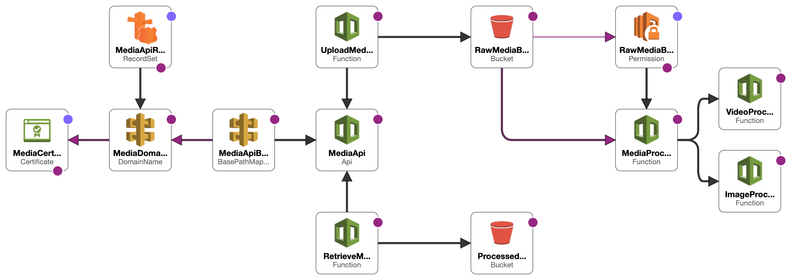

# AWS Media Uploader

## Backend architecture

This application has several components:

- Two Amazon S3 buckets to store raw and processed media files.
- Two AWS Lambda functions to upload and process media files.
- AWS Certificate Manager to handle SSL for the custom domain.
- Amazon API Gateway to handle incoming requests.
- AWS Route53 for DNS configuration.

Here is a quick overview of the AWS infrastructure for hosting a React website on S3. Below diagram summarizes the architecture.



### Requirements

To deploy and run this application, you need:

- AWS SAM CLI
- AWS CLI
- Python 3.9
- AWS Account with appropriate permissions

### Setup AWS CLI and Credentials

Before deploying the application, you need to setup the AWS CLI and configure your AWS credentials.

1. Install the AWS CLI. You can follow the official guide [here](https://docs.aws.amazon.com/cli/latest/userguide/cli-configure-files.html).

2. Configure your AWS credentials by running `aws configure`. You'll need your AWS Access Key ID, Secret Access Key, and default region name.

```bash
aws configure
```

### Building the Application

To build the application, navigate to the project root directory and run:

```bash
sam build
```

This command will compile your lambda functions and create a deployment package in the `.aws-sam/build` directory.

### Deploying the Application

To deploy the application, you can use the `sam deploy` command with guided mode on:

```bash
sam deploy --guided
```

You'll be asked for the stack name, AWS region, and parameters (like your custom domain name, root hosted zone, and bucket names). The command will create necessary CloudFormation stack and deploy your resources.

## Project setup

### Virtual Environment

1. **Navigate to the project directory:**

   ```
   cd /path/to/project
   ```

2. **Create and activate the virtual environment:**

   - On **Linux/Mac**:

     ```
     python3 -m venv env
     source env/bin/activate
     ```

   - On **Windows**:

     ```
     py -m venv env
     .\env\Scripts\activate
     ```

3. **Install dependencies:**

   ```
   pip install -r requirements.txt
   ```

4. **Exit the virtual environment:**

   ```
   deactivate
   ```

Remember to replace /path/to/project with the actual path to your project directory. This guide assumes that you have a requirements.txt file in your project directory. If not, you'll need to create one with the `pip freeze > requirements.txt` command while the virtual environment is activated and all necessary packages are installed.

### Pre-commit hooks

1. **Install pre-commit**: This can be achieved using pip, as shown below:

   ```bash
   pip install pre-commit
   ```

2. **Configure pre-commit hooks**: The configuration for pre-commit hooks is stored in the `.pre-commit-config.yaml` file, located in the root of the repository. The hooks included in this project are:

   - **Black**: A Python code formatter.
   - **Flake8**: A Python tool that bundles pep8, PyFlakes, and Ned Batchelder’s McCabe script for code linting.
   - **isort**: A utility to sort Python imports.
   - **mypy**: An optional static type checker for Python.
   - **Pytest**: Runs tests using the pytest framework.

3. **Install git hook scripts**: The following command installs the git hook scripts:

   ```bash
   pre-commit install
   ```

Upon successful installation, these pre-commit hooks will automatically format the code and check for issues each time a new commit is made, ensuring code quality and consistency throughout the development process.
