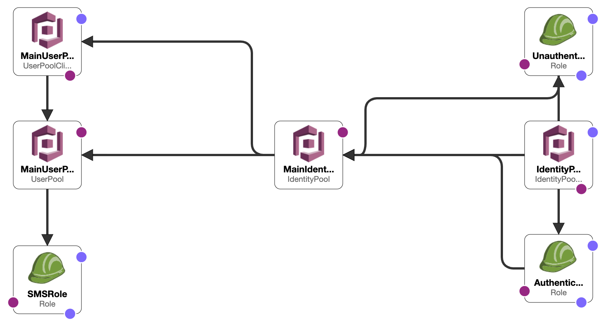
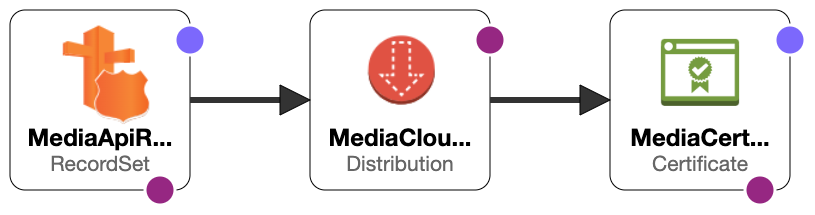
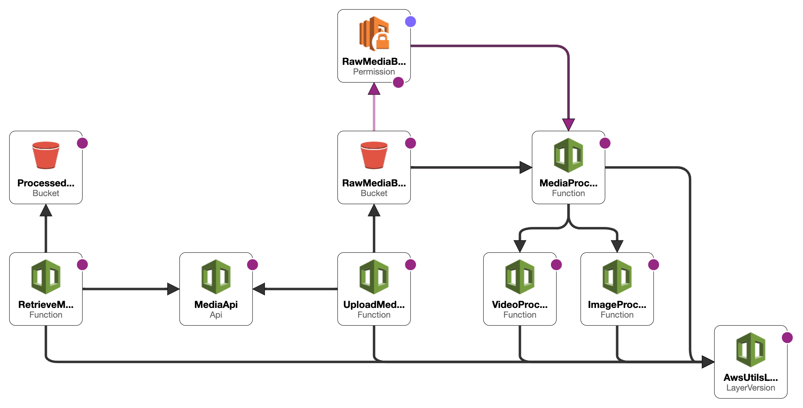

# AWS Media Uploader

## Backend Architecture

This application has several components:

### Cognito

1. **Parameters**: `RawMediaBucketName` and `ProcessedMediaBucketName` representing S3 buckets for raw and processed media.

2. **Cognito User Pool (MainUserPool)**: User pool with SMS verification and a relaxed password policy. An IAM role (`SMSRole`) is created for Cognito to send SMS.

3. **Cognito User Pool Client (MainUserPoolClient)**: User Pool Client using SRP protocol for authentication and allowing refresh tokens.

4. **Cognito Identity Pool (MainIdentityPool)**: Identity Pool providing AWS credentials to users (authenticated and unauthenticated), integrated with the User Pool and User Pool Client.

5. **IAM Roles**: `AuthenticatedRole` grants write access to the raw media bucket and read access to the processed media bucket. `UnauthenticatedRole` provides read access to the processed media bucket.

6. **Cognito Identity Pool Role Attachment**: Associates IAM roles with the Cognito Identity Pool based on the user's authentication status.

7. **Outputs**: Outputs the User Pool ID and ARN.



### CloudFront

1. **Parameters**: The template accepts parameters such as `MediaApiId`, `MediaApiStage`, `MediaDomainName`, and `RootHostedZone`. These are used to tailor the resources within the template like the API Gateway, CloudFront Distribution, and Route53 record set.

2. **Certificates (MediaCertificate)**: An AWS Certificate Manager (ACM) SSL certificate is generated using the domain name given in the `MediaDomainName` parameter, employing DNS validation.

3. **CloudFront Distribution (MediaCloudFrontDistribution)**: A CloudFront distribution is provisioned to act as a content delivery network (CDN) for the application. It is configured with the domain name from the parameters and integrates with the API Gateway specified by the `MediaApiId` and `MediaApiStage` parameters. The distribution supports secure HTTPS connections only and utilizes HTTP2.

   The distribution is configured with a custom viewer certificate from ACM (`MediaCertificate`) to cater to HTTPS requests. The viewer protocol policy is set to "redirect-to-https", which ensures all incoming HTTP requests are redirected to HTTPS.

   The default cache behavior of the CloudFront distribution allows GET, HEAD, and OPTIONS methods, forwards all query strings, and doesn't forward cookies.

4. **Route53 Record Set (MediaApiRecordSet)**: A DNS record set is created in the provided `RootHostedZone` which associates the domain name with the CloudFront distribution. This enables the application to be accessed using the custom domain name.



### API and S3 Buckets

1. **Parameters**: `RawMediaBucketName`, `ProcessedMediaBucketName`, `MainUserPoolId`, and `MainUserPoolArn`.

2. **Lambda Layer (AwsUtilsLayer)**: A reusable layer for common AWS utilities, compatible with Python 3.9.

3. **Lambda Functions**:

   - **ImageProcessingFunction**: Processes images, with read access to raw media and CRUD access to processed media.
   - **VideoProcessingFunction**: Processes videos, with the same access as above.
   - **MediaProcessingDispatcher**: Dispatches media processing tasks to the correct function based on the media type, with the same access as above.
   - **UploadMediaFunction**: Handles media uploads, with CRUD access to the raw media bucket.
   - **RetrieveMediaFunction**: Retrieves processed media, with read access to the processed media bucket and basic Lambda execution permissions.

4. **Lambda Permissions (RawMediaBucketEventPermission)**: Allows the MediaProcessingDispatcher function to be triggered by events in the raw media bucket.

5. **S3 Buckets**:

   - **RawMediaBucket**: Stores raw media, triggers the MediaProcessingDispatcher function on object creation.
   - **ProcessedMediaBucket**: Stores processed media, automatically deletes objects after 30 days.

6. **API Gateway (MediaApi)**: Serves as the public endpoint for uploading and retrieving media, using the MainCognitoAuthorizer for authentication.

7. **Outputs**: Outputs the Media API ID and Stage.

The diagram summarizes the architecture.



### Requirements

To deploy and run this application, you need:

- AWS SAM CLI
- AWS CLI
- Python 3.9
- AWS Account with appropriate permissions

### Setup AWS CLI and Credentials

Before deploying the application, you need to setup the AWS CLI and configure your AWS credentials.

1. Install the AWS CLI. You can follow the official guide [here](https://docs.aws.amazon.com/cli/latest/userguide/cli-configure-files.html).

2. Configure your AWS credentials by running `aws configure`. You'll need your AWS Access Key ID, Secret Access Key, and default region name.

```bash
aws configure
```

### Building the Application

To build the application, navigate to the project root directory and run:

```bash
sam build
```

This command will compile your lambda functions and create a deployment package in the `.aws-sam/build` directory.

### Deploying the Application

To deploy the application, you can use the `sam deploy` command with guided mode on:

```bash
sam deploy --guided
```

You'll be asked for the stack name, AWS region, and parameters (like your custom domain name, root hosted zone, and bucket names). The command will create necessary CloudFormation stack and deploy your resources.

## Project setup

### Virtual Environment

1. **Navigate to the project directory:**

   ```
   cd /path/to/project
   ```

2. **Create and activate the virtual environment:**

   - On **Linux/Mac**:

     ```
     python3 -m venv env
     source env/bin/activate
     ```

   - On **Windows**:

     ```
     py -m venv env
     .\env\Scripts\activate
     ```

3. **Install dependencies:**

   ```
   pip install -r requirements.txt
   ```

4. **Exit the virtual environment:**

   ```
   deactivate
   ```

Remember to replace /path/to/project with the actual path to your project directory. This guide assumes that you have a requirements.txt file in your project directory. If not, you'll need to create one with the `pip freeze > requirements.txt` command while the virtual environment is activated and all necessary packages are installed.

### Pre-commit hooks

1. **Install pre-commit**: This can be achieved using pip, as shown below:

   ```bash
   pip install pre-commit
   ```

2. **Configure pre-commit hooks**: The configuration for pre-commit hooks is stored in the `.pre-commit-config.yaml` file, located in the root of the repository. The hooks included in this project are:

   - **Black**: A Python code formatter.
   - **Flake8**: A Python tool that bundles pep8, PyFlakes, and Ned Batchelder’s McCabe script for code linting.
   - **isort**: A utility to sort Python imports.
   - **mypy**: An optional static type checker for Python.
   - **Pytest**: Runs tests using the pytest framework.

3. **Install git hook scripts**: The following command installs the git hook scripts:

   ```bash
   pre-commit install
   ```

Upon successful installation, these pre-commit hooks will automatically format the code and check for issues each time a new commit is made, ensuring code quality and consistency throughout the development process.
